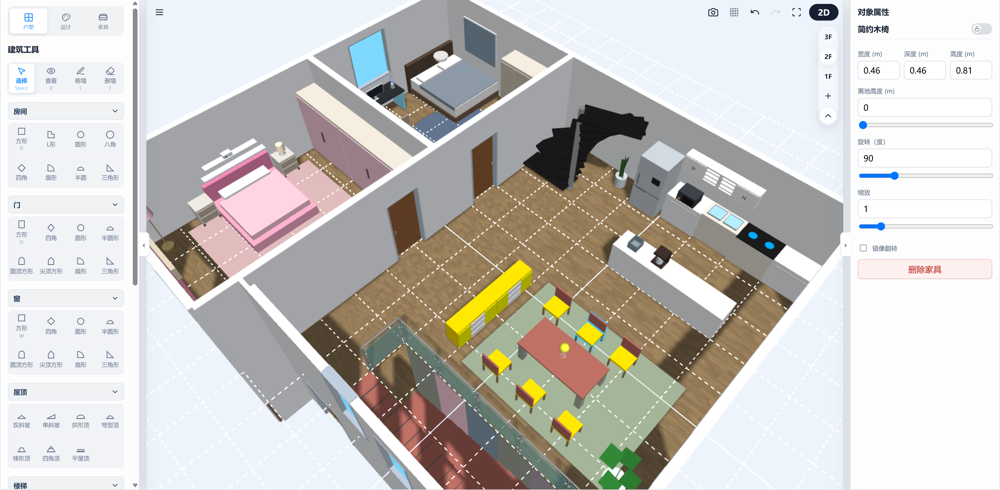

# blueprint3d-babylon

[](https://github.com/BabylonJS/Babylon.js)
[](https://vitejs.dev/)
[](https://opensource.org/licenses/MIT)
[-brightgreen?style=flat-square)](#)
[](#)

`blueprint3d-babylon` 是一个基于 **Babylon.js** 渲染引擎构建的、面向现代网页的轻量级 2D/3D 蓝图式建筑与室内设计编辑核心库。本项目不仅具备高效的 2D 户型排版设计与 3D 场景同步渲染能力，还针对复杂的墙体打洞 CSG 布尔运算、双向状态管理及三维工程数据导出进行了深度的工业级优化，是搭建三维建筑设计软件、家园沙盘系统或元宇宙室内装潢底座的理想开源框架。



> **网络搜索关键词 (SEO Keywords)**:
> `Babylon.js 3D Editor`, `3D Floorplan Editor`, `网页 3D 户型编辑器`, `2D/3D 建筑设计开源库`, `三维室内设计框架`, `CSG 墙体打洞布尔运算`, `CAD DXF 导出`, `3MF 3D打印模型导出`, `前端三维家装沙盘`, `Web 3D 材质涂刷吸管`.

---

## 🔗 在线预览与本地运行

### 🚀 在线演示 (Live Demo)
*   **在线体验地址**: [https://Sunflower613.github.io/blueprint3d-babylon/](https://Sunflower613.github.io/blueprint3d-babylon/)
*   *提供完善的 2D 拖拽、3D 漫游、家电开关控制、材质吸取与分部涂刷、CAD/3MF 图纸导出等全量功能演示。*

### 💻 本地快速启动
如果您希望在本地运行和调试示例项目，请在项目根目录下执行：

```bash
# 1. 安装依赖项目
npm install

# 2. 启动本地开发服务 (基于 Vite)
npm run dev
```
启动成功后，在浏览器中访问以下本地服务地址即可进行调试开发：
[http://127.0.0.1:3000/blueprint3d-babylon/example/index.html](http://127.0.0.1:3000/blueprint3d-babylon/example/index.html)

---

## 🌟 核心能力 (Core Features)

本项目具备完整的现代 2D/3D 家装与户型设计能力。详细的技术实现、算法细节与日常操控说明，请参阅 **[花花家园零基础上手用户指南](docs/features/README.md)**。

主要核心能力概览：

*   🔄 **2D / 3D 双向实时同步**：支持 2D SVG 户型图绘制与 3D Babylon 渲染视口的高效双向同步，完美适配桌面与移动端触控。
*   🧱 **智能墙体与空间拓扑 (Smart Wall & Room Topology)**：内置 8 种预置房间形状，自动计算并渲染封闭区域的物理墙面、地板与实际面积；提供网格吸附与拖拽临时锁。
*   ✂️ **无缝 CSG 开洞与拾取代理 (CSG Cutters & Pick Proxy)**：拖拽门窗时动态生成 Cutter 进行 CSG 布尔挖洞并无缝缝合边缘；为隐藏的玻璃等保留极低可见度的碰撞拾取代理，支持拖拽延时开洞计算。
*   🚪 **高级双开门对称动画**：自动建立相反角度的旋转铰链（Hinges），实现对称门扇的同步扇形开启，规避复杂的布尔网格运算，性能卓越。
*   🖌️ **智能材质刷与取色吸管 (Pipette & Paint System)**：支持单表面或整包材质的高效吸取（吸管）；提供局部精细涂刷（材质刷）与房间内侧墙面、家具批量同步（油漆桶）功能。
*   🔌 **家电状态与 3D 特效联动 (Appliance Control)**：可在 2D/3D 中开启/关闭家电状态，联动材质发光、自转摆头、物理微震以及局部 Spotlight 光源挂载回收。
*   🪞 **多级反射与画面纯净化 (Multi-Level Reflection & Purifying)**：支持高级渲染模式下主/次镜面像素级平面反射（2048/1024 像素）与金属反射探针热切换；应用视差纠正精确对齐环境倒影，自动过滤坐标轴与辅助线等非渲染噪点。
*   📐 **多楼层及工程级数据导出 (CAD & 3D Print IO)**：支持多楼层管理与 `*.b3dbuilding.json` 导出；一键输出分图层带尺寸线的 CAD (DXF) 建筑平面图，以及水密闭合可直接 3D 打印的 3MF 制造文件。

    | CAD 导出图纸预览 | 3MF 3D打印模型预览 |
    | :---: | :---: |
    |  |  |

---

## 🛠️ 项目重构状态与技术架构

本项目已成功完成第三阶段重构，确立了职责清晰的分层架构（包括 `domain` 数据域、`runtime` 3D 渲染和 `editor` 交互Facade）以及严格的依赖隔离规则。

详细的技术架构图谱、分层依赖关系与日常开发指南，请参阅：
👉 **[项目重构技术架构文档](docs/refactor/02_api.md)**

---

## 📝 核心 API 示例

重构后的系统由统一封装的 `EditorFacade` 控制器提供外部服务，外部集成（例如 `example/app.js`）完全采用面向 Facade API 消费的开发方式。

完整的 API 分类表、废弃路径与全新 `createEditor` 使用代码范例，请参阅：
👉 **[Consumer API 使用指南](docs/refactor/consumer-api.md)**

---

## 🧪 自动化测试验证

项目配置了完整的自动化回归测试用例。您可以随时在本地执行验证，确保在进行二次开发或架构调整时核心计算逻辑没有退化：

```bash
# 运行全部 36 项自动化单元测试
npm run test
```

测试覆盖了 `exporters.test.mjs`（CAD/3MF 导出器格式验证）、`openingVisibility.test.mjs`（门窗隐藏及代理）、`roomShapes.test.mjs`（多边形拓扑网格）和 `appliancePower.test.mjs`（家电开关动效）等重要模块，为您项目的生产交付保驾护航。

---

## 🤝 开源与开发贡献

我们欢迎各位开发者参与到 `blueprint3d-babylon` 的开源生态共建中。在提交 Pull Request 之前，请确保您的代码能够全部通过单元测试（`npm run test`），并注意遵守 JSDoc 的类型声明标准。

### 后续迭代与演进路线
1. **智能飘窗结构 (REQ-14)**：支持在标准墙面上放置飘窗，实现墙体精确扣除窗体面积，飘窗凸出部分多网格动态合并与正常渲染。
2. **可互动家具动画 (REQ-18)**：为秋千等特定家具提供点击交互支持，触发对应的物理摆动或动画状态机控制。
3. **性能优化**：图库单独上传，性能消耗检测与优化，降低移动端运行发热。
4. **拆包**：做 npm 库，再拆成：@blueprint3d/core等。

*版权所有 (c) MIT License.*
