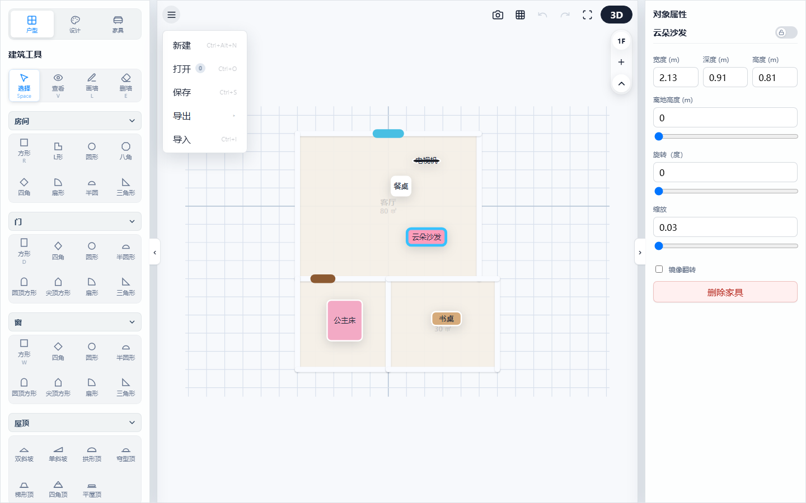
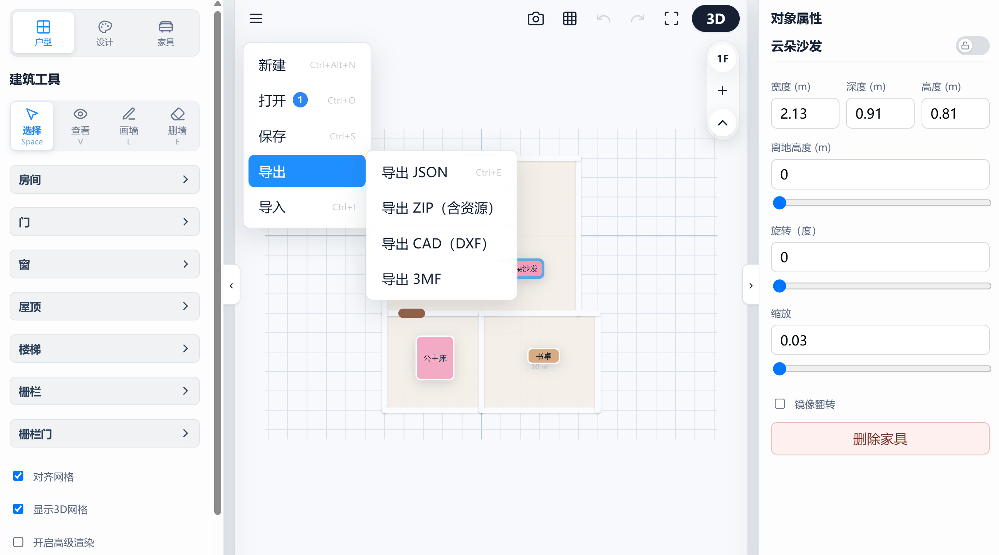
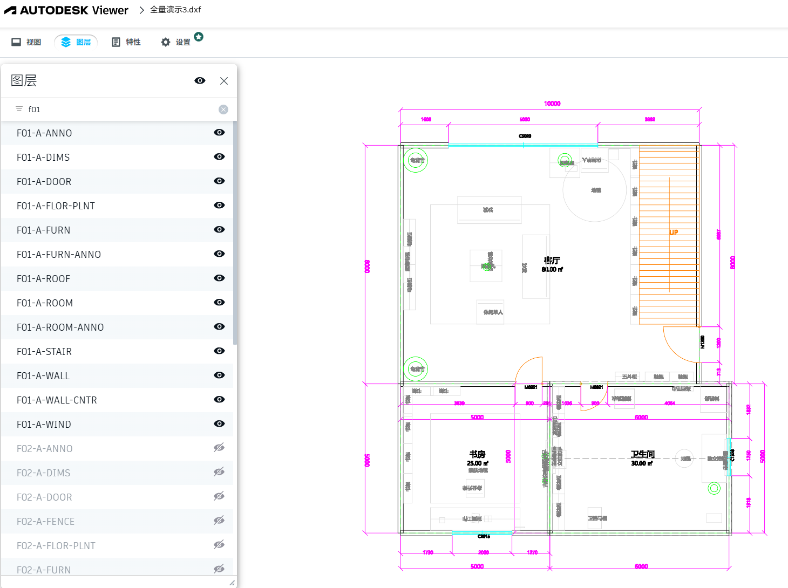
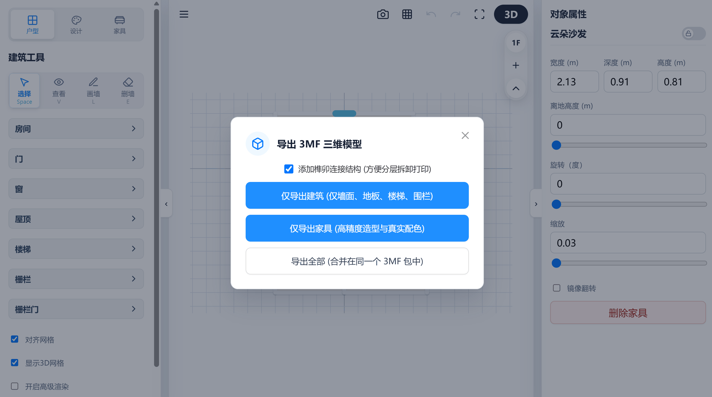
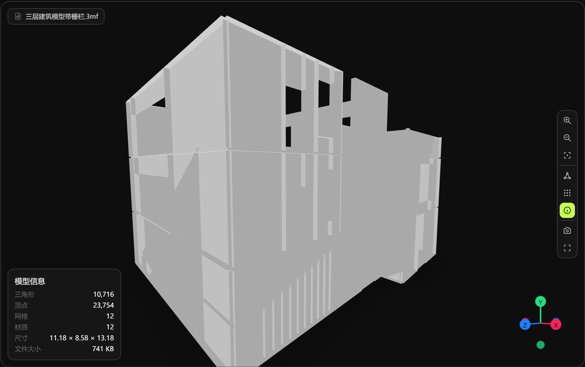

# 3D 户型设计器：项目管理与文件导出指南

本章节将为您详细介绍设计器中的全局文件操作、数据备份回溯机制，以及如何导出各类专业制造与工业级制图格式文件。

---

## 1. 全局项目文件管理

您可以通过界面顶部的文件菜单对设计项目进行全局管理：

*(图例：展开文件下拉菜单)*

*   **新建项目 (Ctrl+Alt+N)**：
    清空当前画布下的所有设计（包括多楼层定义、所有墙段、门窗、家具配置等），并将操作历史记录清空复位。
*   **打开项目 (Ctrl+O)**：
    加载您在浏览器本地存储（`localStorage`）中保存的历史项目列表。
*   **主动保存 (Ctrl+S)**：
    手动输入名称，将当前设计项目保存至本地数据库中。

---

## 2. 高可靠性双轨自动保存机制

为了防止因浏览器崩溃、断电或页面意外刷新导致的心血流失，系统部署了高可靠的双轨保存机制：

*   **静默周期自动保存**：
    系统在后台启动了一个频率为 **10分钟（600,000毫秒）** 的自动保存定时器。它会自动捕获当前的建筑数据、用户自定义材质库状态、折叠工具栏状态及 UI 状态，并在保存成功时给出淡入式的气泡提示。
*   **断电强恢复**：
    当页面重新加载时，系统会在毫秒级内自动还原全部墙体网格、相机的对焦位置和历史回溯栈，确保您的设计进度毫无断代。
*   **80步撤销回溯栈**：
    记录完整的操作历史，您可以在各种设计修改（增删墙体、材质涂刷、物体位移）间使用 `Ctrl+Z` 撤销或 `Ctrl+Y` 重做，支持最大 **80 步** 的历史深度。

---

## 3. 专业级多格式导出

> 💡 **操作演示：**
> 
> 
> *(图例：展开顶部“文件”菜单，再点击导出，可以选择4种导出方式)*

设计器不仅服务于效果图展示，还打通了工业制图与 3D 制造生态：

### 3.1 导出为标准化数据包
*   **导出 JSON (Ctrl+E)**：生成轻量级的自定义结构化数据文件，保存完整的层级树、墙段、门窗位置参数及家具配置。
*   **导出 ZIP (含资源压缩包)**：将工程数据与所有自定义上传的材质贴图图片（Base64 资源形式）以及自定义家具统一归档打包，一键生成压缩包导出，确保工程跨设备交接时的自定义资源不丢失。

### 3.2 导出符合工业标准的 CAD 图纸 (DXF)
系统能够一键将户型图导出为符合工业标准的建筑平面图纸。
*   **自动图层集分离**：墙体自动存入 `F01-A-WALL`，门存入 `F01-A-DOOR`，窗户归入 `F01-A-WINDOW`，文字及面积归入 `F01-A-TEXT`。
*   **智能几何渲染**：在 CAD 图纸中自动绘制出精确的双线墙壁面、门扇开启方向指示圆弧线、几何尺寸线以及房间面积注释，可被 AutoCAD、天正等软件无缝打开编辑。

    | CAD 导出图纸预览 |
    | :---: | 
    |  | 

### 3.3 导出 3D 打印制造格式 (3MF)
为桌面级 3D 打印制造而专门设计的完美模型文件格式。
> 💡 **操作演示：**
> 
> 
> *(图例：点击3mf导出，可以选择家具和建筑分离导出)*

*   **导出向导与榫卯结构选项**：点击导出后，系统会弹出高级 3MF 配置面板。在此您可以选择 `添加榫卯连接结构`（自动在相交表面生成物理插销与定位孔，方便 3D 打印后的实体进行乐高式的积木拼接与拆卸展示），并支持“仅导出建筑”、“仅导出家具”或“合并导出全部”三种实体提取过滤策略。
*   **多实体独立导出**：每个楼层和家具作为独立命名的实体进行导出，完整保留家具的 RGB 基材高清颜色描述。
*   **CSG 动态掏洞与水密网格处理**：系统在导出时会自动检测 3D 渲染器状态，并自动进行 CSG（构造实体几何）动态挖洞和边缘缝口缝合，确保导出的 3MF 模型具有完美的网格拓扑闭合特性，杜绝 3D 打印切片软件中的打印路径报错（如空洞、断层）。

    | 3MF 3D打印模型预览 |
    | :---: | 
    |  |

---

## 4. 导入与工程还原

系统不仅支持丰富的导出，还能一键导入已保存的工程文件进行二次修改：

*   **载入本地工程 (Ctrl+O)**：在“文件”菜单中点击“打开”或使用快捷键，即可选择载入本地 `.json` 数据文件或包含 Base64 自定义纹理贴图的 `.zip` 压缩工程包，进行毫秒级的全场景渲染还原。
*   **鲁棒的容错与纠删恢复**：工程在载入时会自动执行数据自愈与水密性拓扑检验。若发现网格定义受损，系统会采用降级拓扑进行自动修补并对损坏部分进行无损容错，确保即便是不完整的文件也能最大程度恢复，守护设计师的劳动成果。