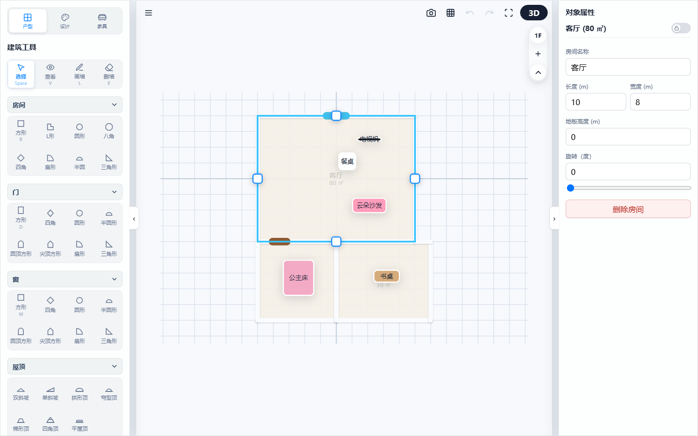
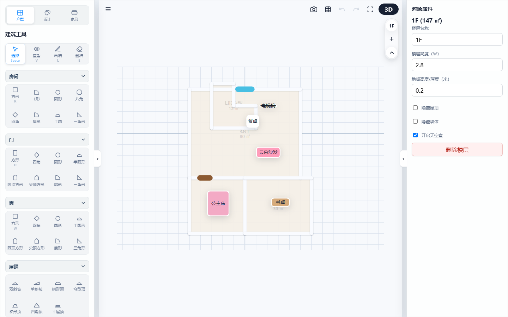
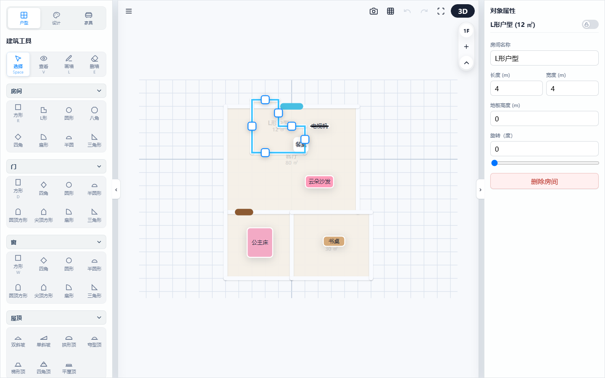
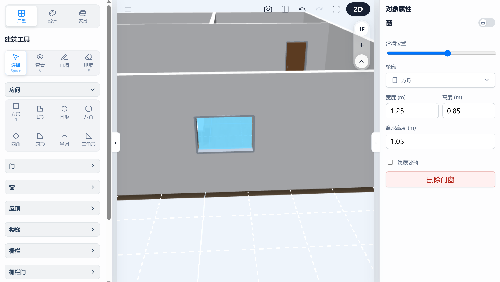
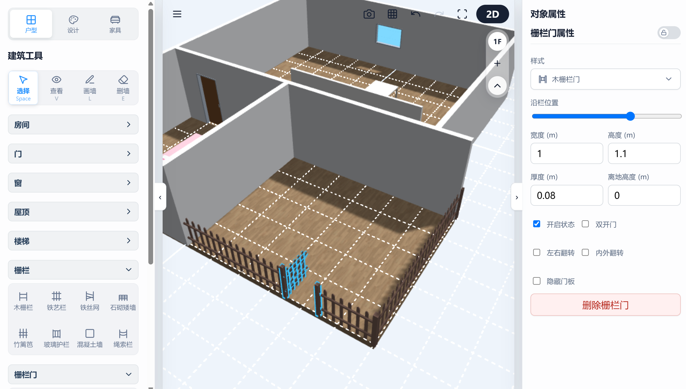

# 3D 户型设计器：墙体绘制与硬装搭建指南

本章节将引导您如何从零开始绘制房间墙体，并添加门窗、楼梯、栅栏等建筑硬装结构。本系统支持 2D 平面绘制与 3D 效果实景的实时双向同步。

---

## 1. 基础绘制模式

在画布左上角或使用快捷键，可以快速切换鼠标的操控状态：

*   **选择模式 (快捷键: Space)**：默认模式。在此模式下，您可以点击选中画布中的任何房间、墙体或家具，并在右侧属性面板中查看和修改它们的具体参数。
*   **查看模式 (快捷键: V)**：抓手模式。用于拖拽移动整个画布的视角，方便环顾四周，此模式下不会误触或移动任何物体。
*   **画墙模式 (快捷键: L)**：
    *   **2D 徒手画墙**：在 2D 视图下，点击确定起点，移动鼠标并再次点击确定终点，即可连续绘制墙体。系统默认的墙体高度为 2.8 米，厚度为 18 厘米。
    *   **智能网格吸附**：鼠标移动时会自动捕捉最近的网格交点（默认步长为 0.5 米），确保您绘制出的墙体夹角绝对规整。
    *   **自动生成地板与面积**：当您绘制的多段墙体首尾相连形成一个完全封闭的区域时，系统会自动将该区域识别为一个“房间”并铺设地板。选中该房间时，**右侧的属性面板中会实时计算并显示该房间的实际使用面积（㎡）**。

> 💡 **操作演示：**
> 
> 
> *(图例：选中 2D 闭合生成的客厅房间，右侧对象属性面板与 2D 中心将实时显示并计算当前房间的面积)*
> 
> *   **多层面积汇总显示**：系统还支持在右侧楼层属性栏标题后，**以括号的形式实时计算并展示出当前楼层所有房间的面积总和（如 1F (110 ㎡)）**，方便设计师宏观掌控整层的得房率与整体面积规划。
*   **删墙模式 (快捷键: E)**：激活橡皮擦光标，点击画布上的任意一段墙体即可将其快速拆除。进入删墙模式后，网格层将变为警示红底色，鼠标光标转为橡皮擦样式。

> 💡 **操作演示：**
> 
> 
> *(图例：按下快捷键 E 激活删墙模式后，网格层背景变为淡红色以示警告)*
---

## 2. 放置与调整建筑组件

### 2.1 智能房间形状拖拽

系统提供了 **方形、L形、圆形、八角形、菱形、扇形、半圆形、直角三角形** 8 种预设房间形状，您可以直接将它们拖入画布中。

*   **L 形房间的特殊调节**：
    拖入 L 形房间后，点击内折角处特有的**控制手柄**，可以直接拖拽调节缺角的宽度和深度。系统内置了安全限制（最小不低于 0.2 米），防止拖拽过度导致房间结构塌陷。
*   **拖拽临时锁机制**：
    拖动房间位移时，网格吸附与拓扑包含算法会自动启用临时锁，只联动该房间内部的关联家具，防止坐标临时重叠时将房间外的零散家具错误“吸入”网格。

> 💡 **操作演示：**
> 
> 
> *(图例：静态截图，用控制手柄高亮出 L 形房间内折角，展示宽度与深度拖拽调节机制)*

### 2.2 门窗的摆放与微调

您可以将预设的**方窗、圆窗、拱形门、哥特式尖顶窗**等异形门窗直接拖拽到墙体上。

*   **跨墙放置**：系统支持将门窗直接安放在两面墙体的转角连接处。
*   **毫米级键盘微调**：选中已放置的门窗后：
    *   使用键盘 **方向键 (← / →)**：可以沿着墙面以 **5 厘米**为步长微调门窗的左右位置。
    *   使用键盘 **PageUp / PageDown**：可以每次以 **5 厘米**为步长垂直升高或降低窗户的安装高度（离地高度最低限制为 0.1 米）。
*   **动态 CSG 开洞与缝合**：
    在墙体上拖拽门窗时，动态生成厚度 4 倍的 Cutter 实体进行 CSG 布尔相减，并在相交边界自动缝合生成封口网格与整体法线，彻底避免了光影破面与 Z-Fighting 穿模。
*   **无闪白丝滑拖动（延迟开洞计算）**：
    在移动拖拽、旋转期间，为保证画面顺滑且无闪白卡顿，**不对墙体进行实时的重新分割构建**。期间仅动态更新墙体节点 (`TransformNode`) 及其子门窗节点的 `position` 与 `rotation`，直至用户**松手后（拖拽/旋转结束）**再触发全局 `build` 重新计算并开洞。
*   **高级双开门对称动画**：
    针对 `doubleDoor` 配置，自动在左右两侧建立相反角度的旋转铰链（Hinges），实现扇形对称同步开启。底层顶点数据在 X 轴向左右两侧截半裁剪，**不经过布尔运算产生垃圾网格，渲染性能卓越**。

> 💡 **操作演示：**
> 
> 
> *(图例：在 3D 视图下，展示选中墙面窗户后其高亮包围盒手柄及右侧微调参数面板)*

### 2.3 楼梯与栅栏的组合运用

*   **模块化楼梯**：提供直跑、悬空、L形/U形折返、3D旋转及弧形弯楼梯。踏步面板与支撑基座的材质独立分离，且转角平台经过无缝拼接处理，确保绝对不穿模。
*   **栅栏大门智能开洞**：当您将大门拖拽到一根绘制好的栅栏段上时，大门会自动吸附并**智能截断围栏**，隐藏相交处的立柱，自动为您留出干净的通行开口。

> 💡 **操作演示：**
> 
> 
> *(图例：在 3D 视图下，展示大门吸附并精准截断隐藏该处栅栏立柱与围栏的开洞效果图)*