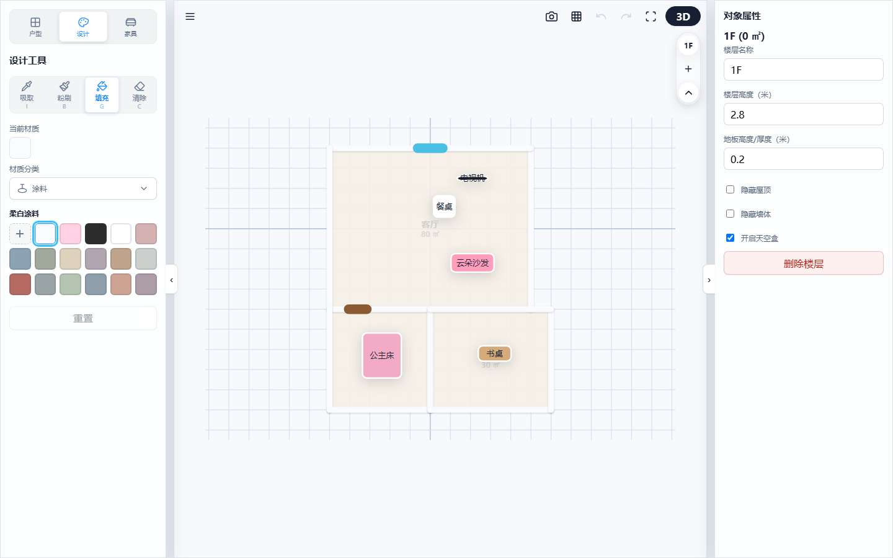
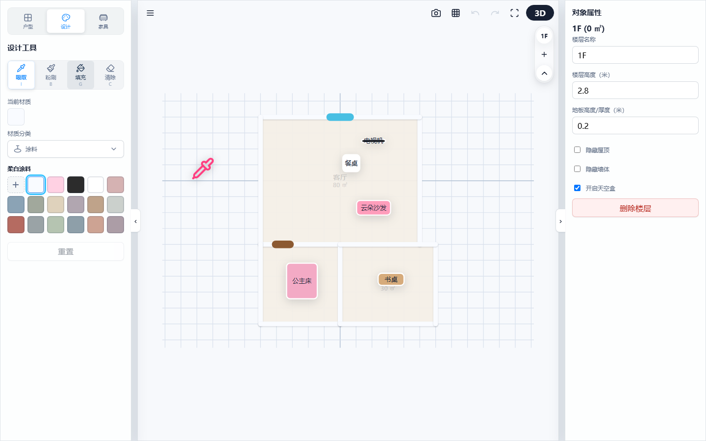
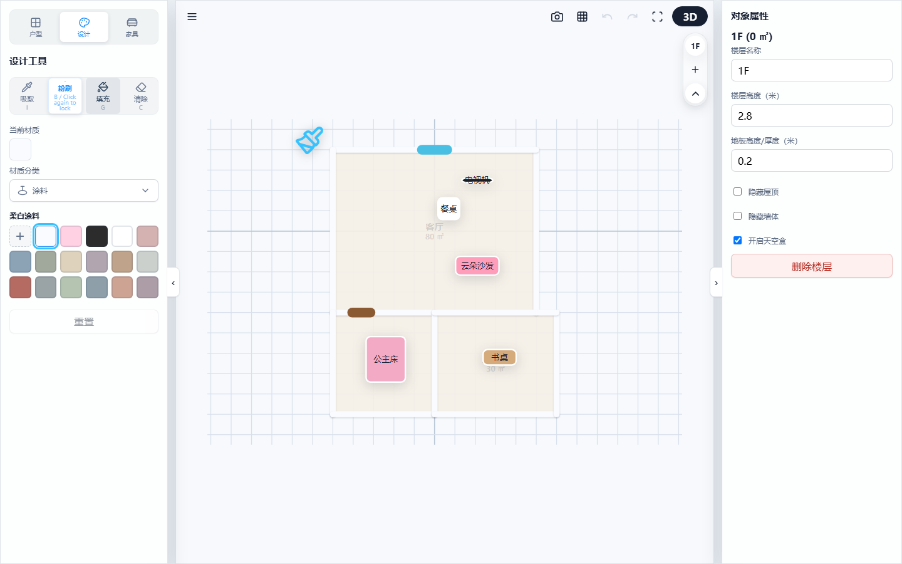

# 3D 户型设计器：材质编辑与表面涂刷指南

系统提供了强大的材质喷涂与取色工具，帮助您快速完成墙面、地板、天花板以及各类家具的个性化色彩与纹理搭配。

---

## 1. 材质设计核心工具

在设计面板顶部，您可以选择以下四种专业涂刷工具：

| 工具名称 | 快捷键 | 功能说明 | 适用场景 |
| --- | --- | --- | --- |
| **取色吸管 (吸取)** | **I** | 点击任意模型表面，可穿透复杂的家具组合，进行**精准吸取**（提取目标子 SubMesh 的单材质）或**全量吸取**（提取并暂存家具的所有材质包为数组）。右键点击家具还能复制整包材质快照。 | 复制已有家具的搭配 |
| **材质刷 (粉刷)** | **B** | 将当前选中的材质或颜色，覆盖喷涂在鼠标点击的单个组件表面上。光标指针会根据选定的单材质或渐变材质数组，在 CSS 样式层和 SVG 矢量层渲染高度同步的渐变/实色画笔指针。 | 局部细节精细化上色 |
| **智能油漆桶 (填充)** | **G** | **空间感应大面积涂刷**： 1. 点击墙面内侧，自动识别该房间，一键替换**整个房间内侧墙面**的材质，不影响外墙。 2. 点击某一家具，一键**同步全屋**同规格、同类型的家具材质。 光标同样支持根据选定的渐变/实色材质在 CSS/SVG 层同步渲染。 | 快速完成全屋墙面铺设或家具风格统一 |
| **材质橡皮擦 (清除)** | **C** | 一键擦除特定表面上的自定义材质，使其恢复为系统默认的底色与初始纹理。 | 方案重置与还原 |

> 💡 **操作演示：**
> 
> 
> ### 💡 深度指南：吸管取色 vs 右键/长按菜单取色

为了给设计师提供最流畅的材质提取体验，系统提供了两种取色路径：

| 维度 | 吸管工具 (快捷键 I) | 右键/长按菜单“提取材质” |
| :--- | :--- | :--- |
| **交互模式** | **精准工具流**。激活吸管后鼠标变为吸管光标，可精准点击一个物体组件吸取材质。 | **快捷复制流**。无需切换当前的工具状态，直接通过右键/长按菜单一键复制材质数组。 |
| **适用场景** | 当您需要**精准地从某个物体组件取色**时。 | 当您处于家具布置模式，想要**快速复制某个家具的材质配方**，而不希望打断当前的摆放逻辑时。 |
| **操作行为** | 提取后为单个“当前材质”，自动激活一次粉刷，可直接涂刷。 | 复制该物体的整个材质数组至“当前材质”，支持轮询粉刷至其他任意家具或建筑组件。 |
> 💡 **操作演示：**
> 
> | 悬浮变色吸管光标 (快捷键 I) | 渐变刷子光标 (快捷键 B) |
> | :---: | :---: |
> |  |  |
> | *(图例：激活吸管后移动鼠标，游标会变为吸取材质颜色的吸管)* | *(图例：右键提取材质数组后，游标转为渐变色的粉刷)*

---

## 2. 自定义材质上传与防拉伸技术

您可以上传本地的 JPG 或 PNG 图片作为自定义墙纸或地砖纹理。

*   **智能防拉伸机制（UV 自适应）**：
    当您将一张图片涂刷到面积非常大的长墙或地板上时，系统会自动感应物理表面的宽高比。一旦超过安全比例，系统会在长轴方向**自动增加平铺重复度（Tiling 补偿）**，确保图案纹理始终保持正常的原始比例，绝不产生拉伸变形或翻转错误。
