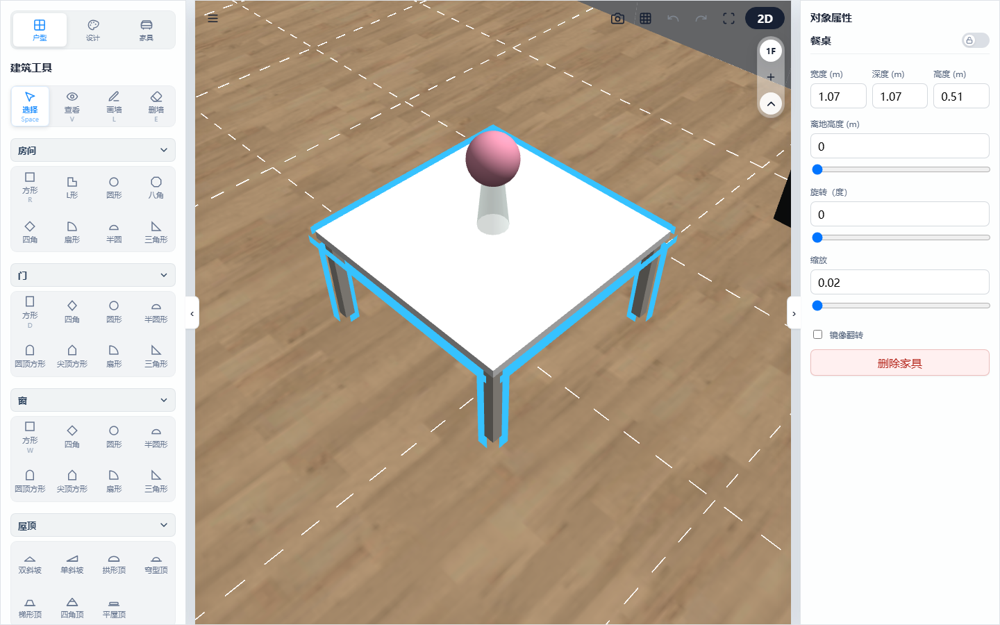
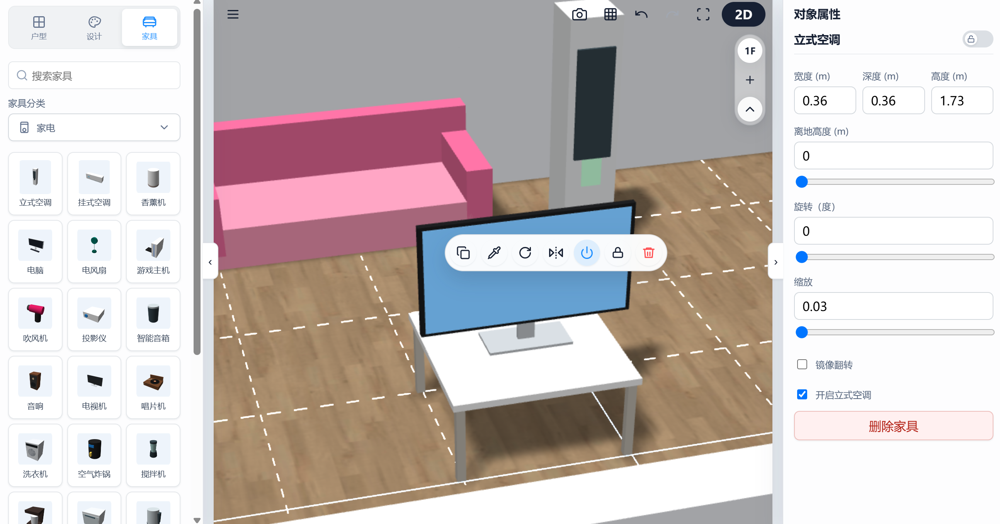

# 3D 户型设计器：家具布置与智能家电特性

本章节介绍如何在场景中检索、摆放各类家具资产，并为您详解系统中独特的“小摆件智能吸附”与“家电特效联动”等高级自动化功能。

---

## 1. 摆件物品的“智能重力吸附”

在摆放水杯、图书、装饰画等小型物品时，您不需要手动小心翼翼地调整高度：

*   **表面自动落锁**：当摆件靠近桌面、格子柜搁板或书架层板时，系统会触发重力感应，**高程自动精准吸附在最近的搁板表面上**，深度自动居中，且移动范围绝不会超出侧板边缘，彻底告别“物体悬空”或“陷进桌面”的尴尬。
*   **层级树跟随联动**：当您移动或旋转底部的书架/桌子时，所有吸附在其表面上的小摆件会自动跟随移动，无需重复调整。

> 💡 **操作演示：**
> 
> 
> *(图例：3D 视图下，展示一个小花瓶摆件被精准重力感应并自动落锁平贴在圆茶几表面的效果)*
*   **格子柜一键填书**：选中置物架或书柜时，点击“一键填书”功能，系统会自动感应每个格子的净深和净宽，智能随机排列不同厚度、高度的书籍，并在空间不足时自动停止，为您瞬间打造充满生活气息的真实书柜。

---

## 2. 家电组件的智能视听特效联动

当您在场景中选中电视、电风扇或投影仪等电器并开启其**属性面板中的开关**时，系统会触发丰富的交互动效：

```
[电器开关开启] 
    │
    ├──> 📺 电视/屏幕  ───> 屏幕自发光 + 呼吸指示灯脉冲 (0.35 ~ 1.0)
    ├──> 🎛️ 唱片机/音响 ──> 唱片匀速自转 + 音箱高频微幅缩放
    ├──> 🎛️ 破壁机/料理 ──> 触发 30Hz 高频、3mm 振幅的物理微震动
    ├──> 🍃 电风扇      ──> 开启 1.5rad/s 的左右物理摆头动画
    └──> 📹 投影仪/电视 ──> 智能挂载一盏聚光灯 (Spotlight)，光强随电器位移同步投影
```

> 💡 **操作演示：**
> 
> 
> *(图例：展示开启状态下的电视机产生屏幕自发光特效，同时右侧属性面板的“开启/关闭”开关呈现勾选开启状态)*
