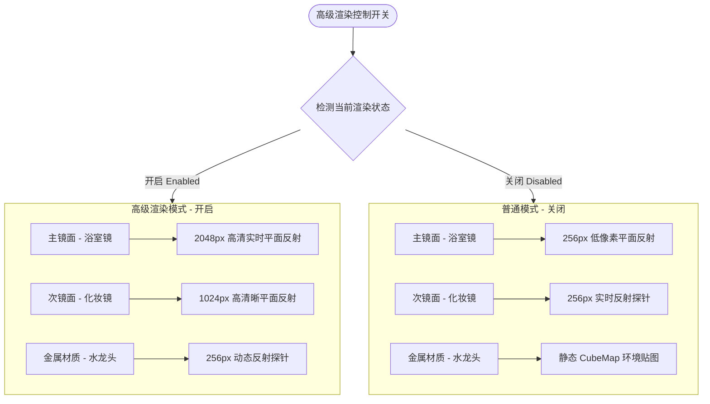
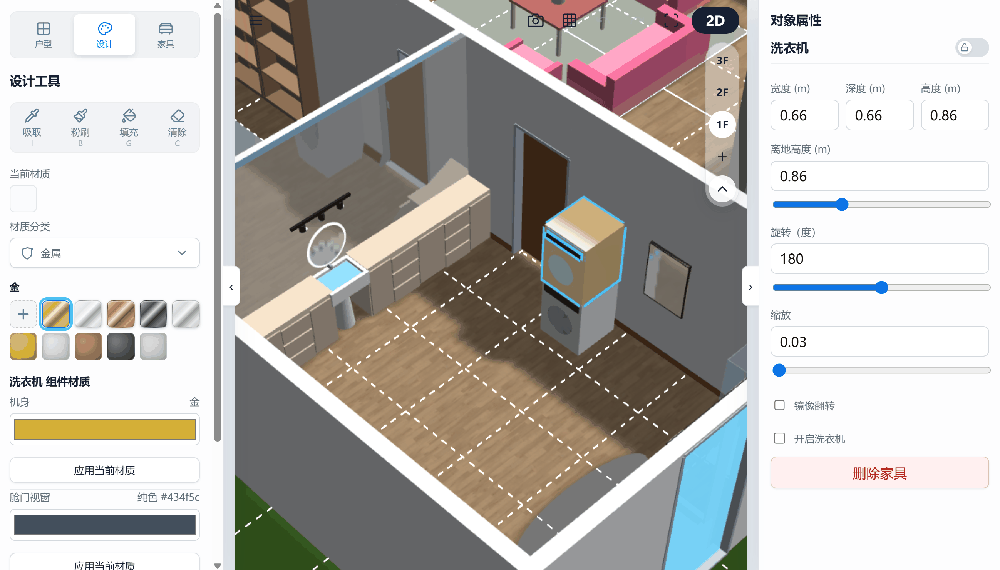
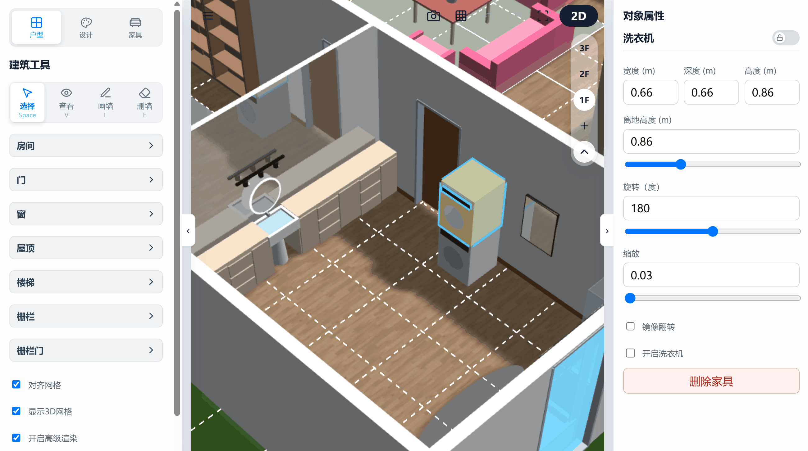
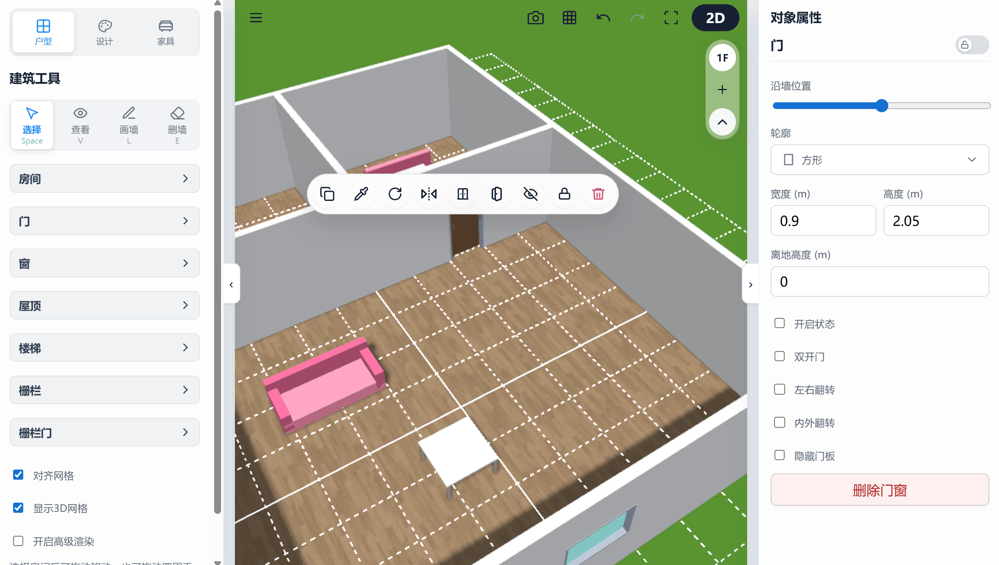

# 3D 户型设计器：视角漫游与高级渲染特效指南

本章节为您详解如何在设计器中进行多维度的相机视角转换、第一人称漫游，以及系统中高级反射与自适应画质热切换的算法细节。

---

## 1. 视口交互与相机手势防冲突

系统在支持灵活手势触控的同时，设计了防冲突的手势隔离机制：

*   **双手操作隔离**：支持移动端/平板端双指触控旋转、平移和缩放 3D 视口。
*   **指针独占锁定**：在移动端或触屏上拖动物体时，系统会自动解绑相机的视角控制（`detachControl`），通过指针独占捕获手势。这保证了在触屏上拖动物体时，背景的 3D 视角绝不会发生剧烈晃动，拖拽结束后无缝恢复视角控制。

---

## 2. 第一人称沉浸式漫游 (WASD)

您可以切换到第一人称视角在您的设计空间内进行实景行走体验：

*   **键盘操控**：使用键盘上的 **W, A, S, D 键** 或方向键在房间里移动，鼠标拖拽控制视角环顾。
*   **视线高度锁定**：相机的绝对垂直高度会被自动锁定在人机工程学的舒适视线高度（离地高程在 **1.6 米至 1.65 米**之间），模拟最真实的室内人眼视觉关系。
*   **胶囊碰撞体防穿墙**：漫游相机挂载了一个半径为 **0.3 米**的隐形胶囊体。当接近墙体或家具时会被物理拦截，阻止穿墙或穿模。当门扇处于开启状态时，该处的碰撞阻挡会自动失效，方便自由穿行。

> 💡 **操作指南：**
> 点击主界面右上角的视角控制键（切换为第一人称图标）即可降落至 1.65 米高度。在漫游模式下，键盘的 Q/E 键可以辅助调节精细的上下视线高度，帮助您以最真实的视角检查层板和柜体安装高度。*(注：当前第一人称漫游功能正处于 Beta 阶段)*

---

## 3. 多级镜面反射渲染方案

当开启“高级渲染”开关时，系统为极致画质与流畅帧率的平衡对镜面与金属反光执行物理分级：

* 🪞 **多级镜面与反射方案 (Multi-Level Reflection Strategy & Resolution Grading)**：
    *   **开启高级渲染控制**：在 UI 侧集成了“开启高级渲染”控制开关，支持场景反射贴图与反射机制的**低延迟动态热切换**，在不重启地图渲染的前提下进行反射渲染类型的动态切换，并且自动管理底层贴图与观察者的生命周期，防止内存泄漏。
    *   **平面反射材质 (`kind === 'mirror'`) 分级尺寸**：
        *   **开启高级渲染**：
            *   **主镜面**（如浴室镜等，`isMainMirror`）：升级为 **2048 像素** 高清实时平面反射，呈现细腻的无卡顿高保真镜像（取消低像素模式）。
            *   **次要镜面**（其他镜子）：升级为 **1024 像素** 的高清晰平面反射，在提供清晰画质的同时保障帧率平稳。
        *   **关闭高级渲染（普通模式）**：
            *   **主镜面**：降级使用 **256 像素** 的低像素平面反射 `MirrorTexture`，确保低端设备流畅度。
            *   **次要镜面**：降级为 **`ReflectionProbe` (区域反射探针)**，获取近似的环境倒影。
    *   **金属反射材质 (`kind === 'metal'`) 分级**：
        *   **开启高级渲染**：升级为 **`ReflectionProbe` (反射探针)**，提供具有物理倒影感的动态高光反射。
        *   **关闭高级渲染（普通模式）**：自动还原并安全恢复金属最初的**静态 CubeMap**（从 `materials.js` 克隆源备份中还原），保留原有漫反射及高光色。

  | 普通渲染模式 |
  | :---: | 
  |  | 
  | *(图例：给物体粉刷上镜面或者金属材质可以看到动态反射的效果)* |

  | 高级渲染模式 |
  | :---: | 
  |  | 
  | *(图例：在户型工具栏的最下面可以勾选开启高级渲染，可以明显看到反射效果更加精细)* |

---

## 4. 右键/长按菜单与隐藏态拾取代理 (Pick Proxy)

*   **隐藏态 pick 代理**：
    当通过右键/长按菜单隐藏门板、窗子玻璃等实体时，如果完全销毁网格或设置 `isPickable = false`，用户在 3D 视图下将无法再次点选它们来重新显示。
    系统为此在原位置保留了一个极低可见度（`visibility = 0.001`）但 `isPickable = true` 的包围碰撞代理。这既保证了视觉上完全隐形，又能够允许用户右键点击该空间区域，唤出菜单将其重新“恢复显示”。

### 💡 深度指南：右键/长按菜单项功能速查

在 2D 或 3D 视图下，右键点击（移动端长按）不同类型的实体，可以唤出专有的快捷菜单：

 

---

| 实体类型 | 右键/长按菜单项 | 功能说明 |
| :--- | :--- | :--- |
| **所有实体** | **复制** | 复制该实体，生成一个相同实体在附近偏移点。 |
| | **吸取** | 吸取该物体当前的材质数组，并进入一次粉刷模式。 |
| | **旋转** | 顺时针旋转90度。 |
| | **翻转** | 左右对称翻转。 |
| | **锁定** | 禁止该物体所有更新，包括位置移动和材质粉刷，但是可以复制和吸取。 |
| | **删除** | 将该物体销毁。 |
| **门** | **单开/双开** | 快捷更改为单双开门。 |
| **门** | **开门/关门** | 快捷更改开启状态。 |
| **门窗 / 窗帘** | **显示/隐藏** | 控制门板和玻璃以及窗帘的显示，不影响选择点击。 |
| **家具：家电** | **开启/关闭** | 开启家电的闪烁动画。 |
| **家具：水槽** | **排水/放水** | 控制水槽的水面变化。 |
| **家具：草木** | **换季** | 切换 春、夏、秋、冬 4套预设颜色。 |
